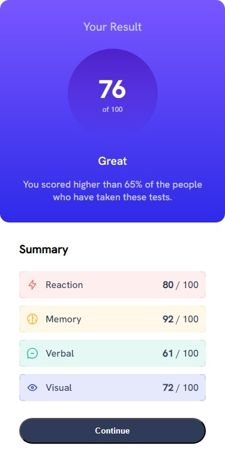
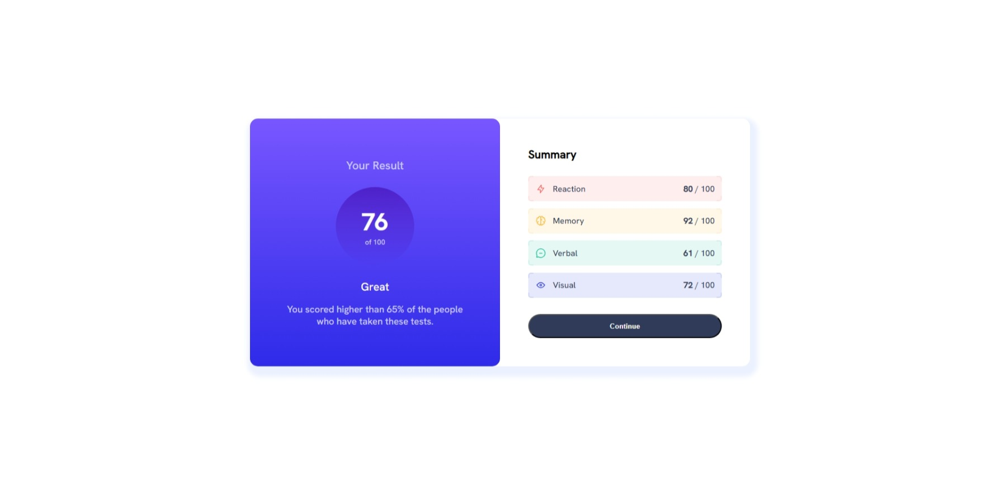

# Frontend Mentor - Results summary component solution

This is a solution to the [Results summary component challenge on Frontend Mentor](https://www.frontendmentor.io/challenges/results-summary-component-CE_K6s0maV). Frontend Mentor challenges help you improve your coding skills by building realistic projects.

## Table of contents

- [Overview](#overview)
  - [The challenge](#the-challenge)
  - [Screenshot](#screenshot)
  - [Links](#links)
- [My process](#my-process)
  - [Built with](#built-with)
  - [What I learned](#what-i-learned)
  - [Continued development](#continued-development)
  - [Useful resources](#useful-resources)
- [Author](#author)
- [Acknowledgments](#acknowledgments)

## Overview

### The challenge

Users should be able to:

- View the optimal layout for the interface depending on their device's screen size
- See hover and focus states for all interactive elements on the page
- **Bonus**: Use the local JSON data to dynamically populate the content

### Screenshot




### Links

- Solution URL: [Solution on GitHub](https://github.com/horoserp/results-summary)
- Live Site URL: [Solution on Live Site](https://horoserp.github.io/results-summary)

## My process

### Built with

- HTML
- CSS
- JavaScript

### What I learned

I learned more about the following:

- Semantic HTML, specifically the use of main, article and aside
- CSS rem unit
- CSS Grid
- CSS Linear-Gradients
- JS Reading a json file and manipulating its data
- JS Create elements and add properties programmatically
- JS Add elements programatically to the DOM

I did not know much about the following and learned a ton about them during this challenge:

- CSS @font-face
- CSS color-mix
- CSS How to create borders only on the corners of a div

I'm particularly proud of the JavaScript that I wrote.

```js
const icon = document.getElementsByClassName("icon");
const bold = document.getElementsByClassName("bold");
const title = document.getElementsByClassName("span_flex");

var xmlhttp = new XMLHttpRequest();
xmlhttp.onreadystatechange = function () {
  if (this.readyState == 4 && this.status == 200) {
    var myObj = JSON.parse(this.responseText);
    for (let key in myObj) {
      icon[key].src = myObj[key].icon;
      title[key].innerHTML += myObj[key].category;
      bold[key].innerHTML += myObj[key].score;
    }
  }
};
xmlhttp.open("GET", "./fem-files/data.json", true);
xmlhttp.send();
```

### Continued development

I would like to continue focusing on learning less common HTML and CSS code, as well as utilizing JavaScipt efficiently.

### Useful resources

- [W3Schools](https://www.w3schools.com/) - This is a great reference site which helped me remember some of the required syntax and generalities surrounding the base of a react project.
- [Stack Overflow](https://stackoverflow.com/) - This is an excellent resource for finding answers to precise questions. I used it once or twice during this challenge.

## Author

- Website - [Robert P. Horosewski](https://horoserp.github.io/React-Portfolio)
- Frontend Mentor - [@horoserp](https://www.frontendmentor.io/profile/horoserp)
- LinkedIn - [Robert P. Horosewski](https://www.linkedin.com/in/robert-horosewski-8a0608196/)

## Acknowledgments

Thanks to my wife for the encouragement to pursue my dream.
